# 
Mental Health Awareness Organization Website

[View the live project here.](https://madyark.github.io/MS1-project/ "MHA Organization website")

This is the website of the Mental Health Awareness Organization. It is designed to be responsive on a variety of devices and accessible from different web browsers, providing ease-of-use to 
potential viewers who wish to learn about mental health, help themselves in their mental struggles, help others who face mental struggles, or support campaigns promoting mental health 
awareness.

The goal for this project was to create a single website where users with different needs can retrieve information on mental health without having to sift through multiple webpages. 

Right now, it is difficult to find a single platform that offers educational value for people who have never faced or even heard about these issues and at the same time offers practical help for the ones who have a great deal of experience 
with such problems and are looking for ways on resolving them. 

Since mental health issues are exceptionally prevalent in modern society, and since stigma leaves the victims of mental illnesses belittled, misinformed, and uneducated, we attempted to create a website within which users can access resources 
to educate themselves, help themselves, help others, and spread awareness on mental health.  

On our website, users can easily navigate across different pages to find the information that they are looking for depending on their interests within the area of mental health and mental health awareness.

# 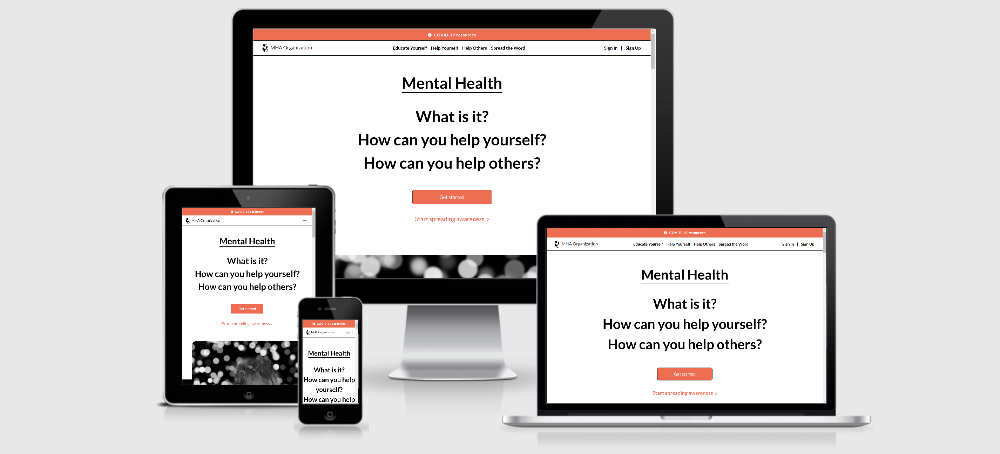 

## User Experience (UX)

- ### User Stories

    - #### Visitor with No Prior Mental Health Knowledge \- Goals

        1. I want to learn more on mental health and its ramifications upon the general population.

        2. I want to read some of the stories of people who suffer from mental health problems to further my understanding of its effect on people's daily lives.

        3. I want to easily navigate around the website to find different bits of information on mental health.

    - #### Visitor with Mental Health Problems \- Goals

        1. I want to learn about the different lifestyle changes I can make to help improve my personal mental wellbeing.

        2. I want to find out what immediate actions I can take to help cope with specific mental disorders such as depression, anxiety, and PTSD.

        3. I want to have knowledge of the specific links, emails, telephone numbers, and other suicide hotline resources in various countries that are available to me.

        4. I want to be able to access informative videos and articles on mental health to help myself feel better, less-isolated, and inspired whenever I am feeling down and facing inner adversity. 

        5. I want to discover links to external apps and other organizations that can be more oriented to my needs and provide further guidance on how to treat my problems.   

    - #### Visitor with Desires to Help Someone with Mental Health Problems \- Goals

        1. I want to have the knowledge on how to help somebody I know in their mental health struggles.

        2. I want to understand the ways I can help somebody I do not know with their mental health problems.

        3. I want to be re-affirmed in my quest to support people with mental health problems by a motivating message, despite my potential frustrations or reservedness. 

    - #### Visitor with Aspirations to Bring Awareness to Mental Health Issues \- Goals

        1. I want to find out why talking about mental health in my sphere of influence is important.

        2. I want to discover the specific ways I can help combat mental health stigma within my community.

        3. I want to learn about what World Mental Health Day is, what is its purpose, how will it help bring awareness to mental health issues, and why should I participate in it.

        4. I want to gain insight into what Suicide Prevention Week is, what I can do to push against the stigma associated with suicide, and how can I help educate the people around me on suicide-prevention.

        5. I want to have access to an online shop where I can purchase clothes with inspirational messages on them that spread awareness on mental health and whose share of profits is donated to a non-profit organization. 

    - #### Administrator of the Website \- Goals

        1. I want to provide an external link to the official WHO Covid-19 website to direct visitors who may be in need of the latest information and tools pertaining to Covid-19 when living in these unique times. 

        2. I want to provide a clean design structure which is both entertaining and simple-to-understand for the visitor, with no obnoxious design features or repetitive layouts. 

        3. I want to add a mock-up of the sign-up page, the sign-in page, and the newsletter-subscription utility to make the website look more authentic and to have them be on stand-by for when I will be able to develop them into functioning tools. 

        4. I want to create the Privacy Notice and Terms-of-Service texts to make the website look more authentic and to have them be on stand-by for when the website gains enough traction to add them in as links. 

        5. I want to have links to the home-pages of different social media websites in the footer to have them on stand-by for when I will create accounts on their platforms to raise public attention on our organization and our mission. 

- ### Design

    - #### Color Scheme

        1. The three main colors used are dark-orange, white, and black. They were used interchangeably as background and foreground colors. 

        2. An orange-red color was used for hovering on active navigation menu elements to provide a more enjoyable user experience.

        3. A dark-blue color was used for displaying links in the 'International Suicide Hotline Numbers' section of the 'Help Yourself' page to draw attention to the user by having a conventional appearance of a web-link.

        4. A light-blue color was used underneath the 'External Links' section of the 'Help Yourself' page to convey greater emphasis on the links.

        5. A gray color was used as the background-color for the 'Mental Health Awareness Newsletter' and 'Mental Health Emergency' sections of the 'Home' page to create a contrast between these sections and the sections that precede them. 

    - #### Typography

        1. The Lato font is the main font used throughout the website with Sans-Serif set as the fallback font if for any reason the Lato font does not render correctly. Lato is considered to be a very professional font that is 
        suitable for both titles and body text.

    - #### Images, Videos, and Other Forms of Media

        1. The images used in this website are always in the foreground, without any text interfering with their appearance. Most of the images have rounded corners to provide them with greater aesthetic appearances. 
        
            The images ensure that the viewer gets a pleasurable experience when scrolling through page contents, rather than having to sift through large pieces of text. They also allow the viewer to gain perspective into what is 
            the context behind different pieces of text. 

            All of the images appear in .jpg (sometimes .jpeg) or .png formats. There were, however, a couple that appeared in the .webp format which allowed for better compression but were since then converted to .png since 
            [some browsers](https://caniuse.com/webp "Chart showing the support status of specific browser versions for .webp files") still do not support .webp files. 

             All of the images are responsive. All of the images have the `` attribute set on them to reduce page load times.

        2. The videos used in this website solely appear in the 'Help Yourself' page of the website. They also have rounded corners for greater aesthetic appearances. 
        
            The videos are inserted as iframe elements of youtube links, and they allow the viewer to decide when to press play and when to press stop. Autoplay is turned off as the website allows the viewer to initiate and control such actions.
            
            All of the videos are responsive. All of the videos have the `<iframe loading="lazy">` attribute set on them to reduce page load times.

        3. An article appears in the 'Help Yourself' page of the website. It also has rounded corners and is also inserted as an iframe element. 
        
            The article is hidden on mobile and tablet devices as the small device screen size makes the iframe difficult to operate. 
            
            The article is responsive. The article has the `<iframe loading="lazy">` attribute set on it to reduce page load times.   

- ### Wireframe

    - Full Wireframe \- [View](wireframes/MS1-wireframes.pdf)

## Features

### Existing Features

- Responsiveness on all device sizes. The website is specifically configured for mobile devices, tablets, laptops, and large desktops. 

- Link to the official World Health Organization Covid-19 Information page, where users can access the latest Covid-19 data, advice, and other resources for guidance.

    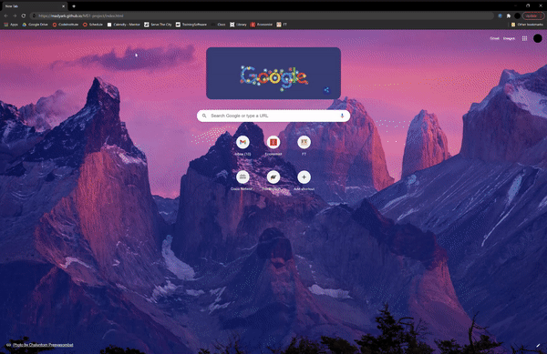

- A responsive navigation bar at the top of every page which contains the links to all pages including the home page through a logo with our organization name. 

    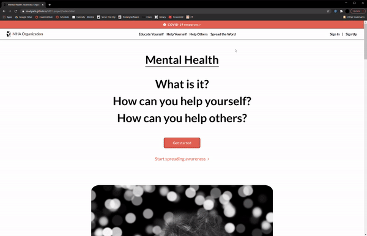

- A responsive footer at the bottom of every page containing a copyright text, an American flag indicating the organization's country-of-origin, language the website is written in, 'Privacy Notice' and 'Terms of Service' texts, and links 
    to the Twitter, Facebook, and Instagram home pages.

    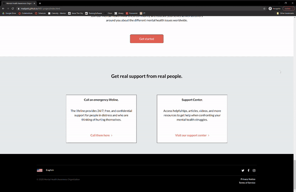

- A call-to-action consisting of four large headers in the 'Home' page, three of which are hoverable links to supplemental pages that change their color from black to orange when hovered upon. 

    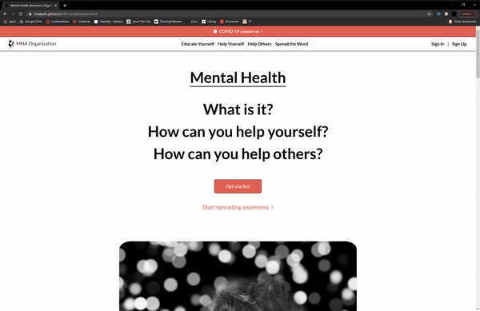

- A 'Get Started' button that appears on multiple pages and provides a direct link to the 'Sign Up' page. 

    

- A 'Start Spreading Awareness' link that also appears on multiple pages (often times in conjunction with the 'Get Started' button) and provides a link to the 'Spread the Word' page.

    

- A scrollable `
` element inside of the 'Suicide Hotlines' section of the 'Help Yourself' page that contains suicide-hotline resources (email addresses, webpage links, telephone numbers) for various countries around the world.

    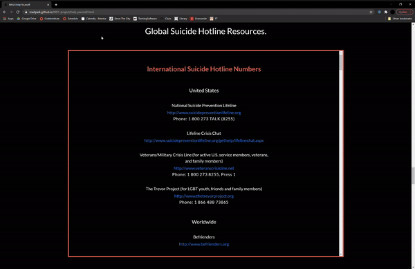

- Four `<iframe>` elements of youtube videos and an article from the 'Scientific American' in the 'Resources' section of the 'Help Yourself' page.

    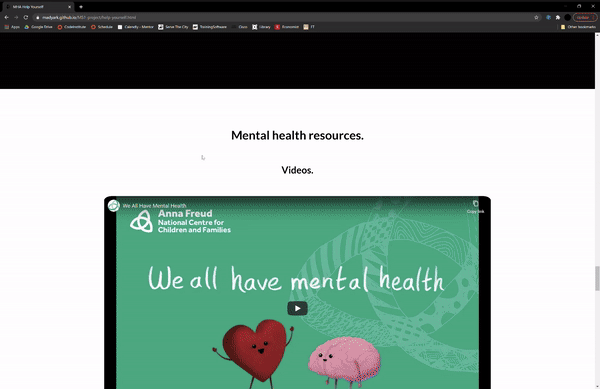

- External links to outside resources (mainly websites and mobile applications) in the 'Resources' section of the 'Help Yourself' page that give the users the opportunity to find support that may be more tailored to their needs.

    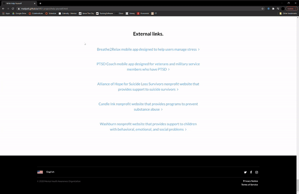

- A link to an external shopping page (Self Care is for Everyone) and images of four different articles of clothing (which are also clickable links) in the 'Shop' section of the 'Spread the Word' page. 

    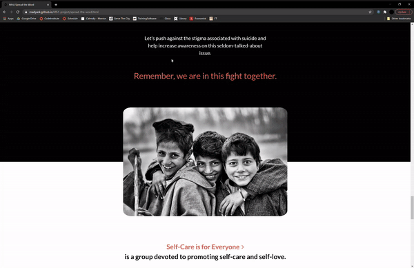

### Features Left to Implement

- Functioning sign-up and sign-in utilities that would allow users to have access to a virtual community where they could recount personal experiences, share uplifting messages, organize events, and potentially give donations to non-profit 
    organizations.

    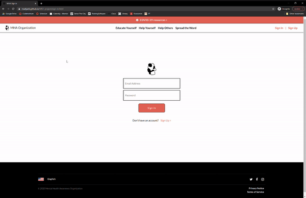

- A functioning monthly newsletter in which participants would be able to receive offical news from our organization, our community events, support articles, tips from industry professionals, and other forms of support from our organization.

    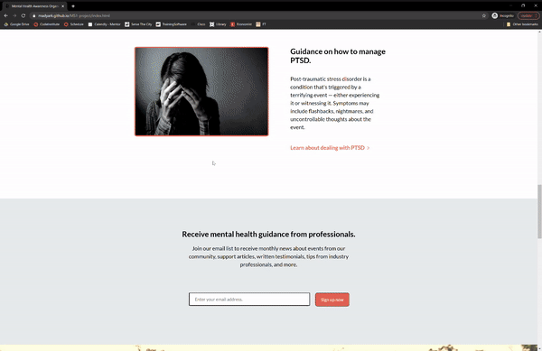

- Official Mental Health Awareness Organization social media accounts on Twitter, Facebook, and Instagram in which we can share our events, inspirational messages, and spread awareness on our mission of encouraging mental health care.

- 'Privacy Notice' and 'Terms of Service' documents which our users can read and agree to before signing up to our platform and agreeing to share their personal data with our organization. 

## Technologies Used

### Languages Used

1. [HTML5](https://en.wikipedia.org/wiki/HTML5)

2. [CSS3](https://en.wikipedia.org/wiki/CSS)

### Frameworks, Libraries, & Programs Used

1. [Bootstrap 4.5.3:](https://getbootstrap.com/docs/4.5/getting-started/introduction/)

    - Bootstrap was used to assist with the navigation bar and its responsiveness on all pages.

2. [Google Fonts:](https://fonts.google.com/)

    - Google Fonts was used to download the 'Lato' font, which was the only font used on all pages.

3. [Font Awesome:](https://fontawesome.com/)

    - Font Awesome was used to download icons for aesthetic purposes and UX. Font Awesome icons were used in the header, footer, and all of the textual-links on all pages.

    - The HTML for all of the Font Awesome icons had to use `<i class="fa">` instead of `<i class="fas">`. The icons would not display themselves when using `<i class="fas">` since Font Awesome version 4 kit was downloaded, not version 5.

4. [Git:](https://git-scm.com/)

    - Git was used for version control through the use of the Gitpod terminal to commit the changed code to Git and push it to Github.

    - Git was especially useful for accessing the code that was previously (intentionally or unintentionally) removed or modified and for adding it back in its original form to the HTML or CSS files.  

5. [Github:](https://github.com/)

    - Github was used for storing the code of the website and accessing it later for future alterations.

    - Github Pages were used to deploy the project, to access the project from various devices, and to share it with friends and family members. 

6. [Gitpod:](https://www.gitpod.io/docs/)

    - Gitpod was used to write all of the code, commit and push changes in the terminal, upload files, create the directory structure of the website, and to write the README.md file.

7. [Favicon:](http://www.prodraw.net/favicon/index.php)

    - Prodraw.net was used to create the favicon which appears on the webpage tab on some browsers. 
    
    - The image used is the [logo of the organization](assets/images/hugging.png), which appears at the very left of the navigation bar on every page. 

8. [Wireframe.cc:](https://wireframe.cc/)

    - Wireframe.cc was used to create the [wireframe](wireframes/MS1-wireframes.pdf) for this project. 

    - Wireframe.cc offered a free-trial that unfortunately ended before all of the wireframe pages had been developed. 
        
        Therefore, the wireframe stops in the middle of the 'Spread the Word' page and lacks content for the 'Sign In' and 'Sign Up' pages. There is also no content for the mobile and tablet responsiveness. 

    - The wireframe created is very high-fidelity, meaning it incorporates high levels of detail. 
    
        This has slowed down the process of drafting the wireframes, but also allowed for a quicker development process as the textual content was simply copy-pasted from the wireframes into the HTML.

        This, in turn, led to a greater prioritization of the HTML page structure, CSS stylings, and the media that was to be hand-picked and used throughout the website. 

## Testing

The W3C Markup Validation Service and the W3C CSS Validation Service were used to validate all of the HTML files and the CSS file, respectively, to ensure that all of the codes used were appropriate and had the correct syntax.

- [W3C Markup Validator](https://validator.w3.org/)

- [W3C CSS Validator](https://jigsaw.w3.org/css-validator/) 

### Testing User Stories from the User Experience (UX) Section

- #### Visitor with No Prior Mental Health Knowledge \- Goals

    1. I want to learn more on mental health and its ramifications upon the general population.

        1. Upon entering the site, the user is greeted with a clean and readable navigation bar where they can find the link to the page titled 'Educate Yourself' (the first link in the middle), which will take them to that exact page whose 
            content is self-revealing from the title.

        1. Below the navigation bar, the user will find a call-to-action that consists of four headers that read 'Mental Health', 'What is it?', 'How can you help yourself?', and 'How can you help others?'. The latter three headers are 
            links to supplemental pages, which when hovered upon change their colors to orange. The user can click on the 'What is it?' header which will take them to the 'Educate Yourself' page.  
        
        1. Inside of the 'Educate Yourself' page, the user can find general information about what mental health is and different figures relating to mental health and mental health issuess.

        1. Additionally, the user can use the materials found at the rest of the supplemental pages to learn more on mental health. This requires more inferences to be made as the content is not tailored for this group, but the supplied 
            information will still provide further context on mental health and its effects.

    2. I want to read some of the stories of people who suffer from mental health problems to further my understanding of its effect on people's daily lives.

        1. After entering the 'Educate Yourself' page from either the navigation bar or the 'What is it?' header-link, the user can scroll down to the 'Stories' section of the page, denoted by the 'Listen to their stories.' text which appears
            in orange. 

        1. The user also can continue scrolling through the 'Home' page until they find an orange link with the text 'Listen to their stories', which is located under two white texts and a black-and-white image. When clicking the orange 
            link the user will head straight to the 'Story' section, without having to scroll through the 'Educate Yourself' page. 

        1. Inside of the 'Story' section, the user will find various extracts from personal anecdotes of the people who have struggled or are still struggling with mental issues.

    3. I want to easily navigate around the website to find different bits of information on mental health.

        1. Upon entering the site, the user will find a vivid navigation bar on every page, which they can use to reach the page of their choice. When accessing one of the supplemental pages, the active-link appears in orange to help the user 
            locate their current location in the website.

        1. Scrolling through the 'Home' page, the user will come across different links that either take them to the top of the supplemental pages of the website or specific sections of those supplemental pages. 

            The links are accompanied by previews of those pages (or sections) which try to persuade the user to press on the links by offering to answer their potential needs.

        1. At the bottom of the 'Help Yourself' page, four links appear (two in white font-color, one black button, and one in black font-color), which respectively take the user to the 'Help Yourself', 'Help Others', 'Sign Up' and 'Spread the 
            Word' pages. 

            This feature, however, does not appear on the other supplemental pages to avoid repetitive layouts (for more desirable design), which compels the user to have to scroll up to the navigation bar in order to access other supplemental 
            pages. Here, website functionality is sacrificed for aesthetic design.

            Yet still at the bottom of the 'Help Others' page, a vibrant orange link appears that will take the user to the 'Spread the Word' page, which comes next in our assigned order of the pages in the navigation bar.
    
- #### Visitor with Mental Health Problems \- Goals

    1. I want to learn about the different lifestyle changes I can make to help improve my personal mental wellbeing.

        1. From the navigation bar, the call-to-action in the 'Home' page, or the first link provided at the end of the 'Educate Yourself' page, the user can access the 'Help Yourself' page. 
        
        1. The 'Help Yourself' page will immediately start with the 'Looking After Yourself' section, where the user will find information on how they can look after their mental health by adopting different lifestyle changes or carrying 
            out certain endeavors. 

    2. I want to find out what immediate actions I can take to help cope with specific mental disorders such as depression, anxiety, and PTSD.

        1. At the 'Home' page, the user can come across the 'Mental Health More Information' section which presents the user with information on three specific mental disorders: depression, anxiety, and PTSD. 
        
            The section is accompanied by three images, three bodies of text giving a general introduction to each of the mental disorders, and three links to the subsections of each disorder in the 'Specific Disorders' section of the 
            'Help Yourself' page.

        1. The user can also scroll through the 'Help Yourself' page until they find the 'Specific Disorders' section (located just after the 'Looking After Yourself' section) which has information on managing specific disorders, such as 
            depression, anxiety, and PTSD. 

        1. After accessing the 'Specific Disorders' section from either the navigation bar or the links from the 'Home' page, the user will find various concise, specific, and to-the-point tips on how to compels with depression, anxiety, and PTSD. 

    3. I want to have knowledge of the specific links, emails, telephone numbers, and other suicide hotline resources in various countries that are available to me.

        1. At the 'Home' page, the user could find the 'Mental Health Emergency' section, which is the last section of the page and appears right before the footer. The user will come across two `
` elements that each contain a body of text 
            and an orange link. 

            By pressing the 'Call them here' link (under the 'Call an emergency lifeline' header), the user will be redirected to the 'Suicide Hotlines' section of the 'Help Yourself' page.

        1. The user can also scroll through the 'Help Yourself' page until they find the 'Suicide Hotlines' section (located just after the 'Specific Disorders' section) which contains a scrollable `
` element of various suicide-hotline 
            resources. 
        
        1. Inside of the `
` the user could find the different names of the organizations around the world that provide immediate help (including chat rooms, hotlines, etc.) to those in need, as well as the links, phone numbers, and even 
            email addresses of those organizations.   

    4. I want to be able to access informative videos and articles on mental health to help myself feel better, less-isolated, and inspired whenever I am feeling down and facing inner adversity. 

        1. At the 'Home' page, the user can once more find the 'Mental Health Emergency' section, the last section of the page. The user will once again come across two `
` elements, with similar structures. 
        
            By pressing the 'Visit our support center' link (under the 'Support Center' header) of the latter `
` element, the user will be sent to the 'Resources' section of the 'Help Yourself' page. 

        1. The user could also find the 'Resources' section by scrolling down on the 'Help Yourself' page (located just after the 'Suicide Hotlines' section). There they will find four embedded `<iframe>` elements (three Youtube videos and one 
            article from the Scientific American).

        1. With access to the 'Resources' section, the user can play the Youtube videos and read the available article (however, only on certain device screen sizes). The videos and the article give support and comfort for people struggling with 
            mental health problems. 
        
            The first video deals with explaining the importance of mental health and ways to improve it; the second video shows how to identify particular warning signs of mental health conditions for young adults; and the third video explains 
            the ways a person with mental health conditions can ask for help and the reasons for doing so. 

            The article describes how loneliness has improved even amidst Covid-19 restrictions in the U.S. It is structured in a more scientific, informative manner, but is still able to convey the feelings of reassurance and self-belief for 
            people struggling with mental health issues, especially during these difficult times.   

    5. I want to discover links to external apps and other organizations that can be more oriented to my needs and provide further guidance on how to treat my problems.   

        1. The user could once again scroll to the 'Resources' section of the 'Help Yourself' page, amongst which they will find an 'External Links' subsection (located after the videos and articles, and just before the footer). They will 
            discover multiple rows of centered links in a light-blue color.

            The link-text describes whether the link is to an app or a website, the organization behind the link, and for whom the links are intended.

        1. Once locating the 'External Links' subsection, the user can click on any of the links, all of whom will take them to an external tab with the relevant web address. These links are apps or websites for people with specific mental 
            health issues or for people with specific needs.  

            On Apple mobile and tablet devices, the links to the apps might open on the 'App Store' application instead of a new tab on their browser.  

- #### Visitor with Desires to Help Someone with Mental Health Problems \- Goals

    1. I want to have the knowledge on how to help somebody I know in their mental health struggles.

        1. From the navigation bar, the 'Home' page call-to-action, or the second link provided at the end of the 'Educate Yourself' page, the user can enter the 'Help Others' page. 

        1. From the 'Help Others' page, the user will quickly find the 'Acquaintance Struggling' section (the first section of the page), which describes in detail the various ways a person can help their close friend or family member who is 
            struggling with mental health problems. 

            The text is assisted with cartoon images, which provide a better user-experience (UX) and allow the viewer to quickly gather context on the content of the accompanying texts. 

    2. I want to understand the ways I can help somebody I do not know with their mental health problems.

        1. After gaining access to the 'Help Others' page, the user can scroll down to the 'Tips' section of the page (the last section which appears just before the footer), where they will be greeted with various concise and specific tips that 
            are centered and boldened in order to obtain their attention.

        1. These specific tips provide information on different ways a person can help increase the mental wellbeing of others around them, without having to know if they suffer from mental health conditions.

        1. There are also tips that deal with giving indirect help to people with mental health conditions (whom you do not have to know) by volunteering for or donating money to a mental health organization. The last tip also serves as a link to 
            the 'Spread the Word' page, and is highlighted with an orange font-color.   

    3. I want to be re-affirmed in my quest to support people with mental health problems by a motivating message, despite my potential frustrations or reservedness. 

        1. When scrolling through the 'Help Others' page, the user will come across a large image of four people holding hands, and text that reads 'Support others the same way you would like them to support you' placed above the image. This is 
            the 'Title' section of the page. 

        1. This image is meant to encourage support for people with mental health conditions, as it calls on the user to think about how they would have liked to be treated if they were in the same position. 
        
            A lot of people who are willing to give their support may sometimes feel reserved (on if their support will be appreciated) or even frustrated (with the person they are trying to help). These are normal feelings to have, but the 
            image and the accompanying text call on them to have perspective, empathy, and courage when extending their support to others.  

- #### Visitor with Aspirations to Bring Awareness to Mental Health Issues \- Goals

    1. I want to find out why talking about mental health in my sphere of influence is important.

        1. Whether it is by using the navigation bar, the last link in orange of the 'Home' page call-to-action, the last link in black at the end of the 'Educate Yourself' page, or the orange link provided at the end of the 'Help Others' page, 
            the user access the 'Spread the Word' page. 

        1. Once in the 'Spread the Word' page, the user can scroll down until they find the 'Reasons why talking about mental health matters' text which commences the 'Talking Mental Health Reasons' section of the page. 

        1. There the user will stumble across three different reasons on why talking about mental health matters, as well as full, detailed explanations behind the each of the reasons. 

    2. I want to discover the specific ways I can help combat mental health stigma within my community.

        1. When scrolling through the 'Spread the Word' page, the user will come across the 'Ways to Fight Stigma' section (just after the 'Talking Mental Health Reasons' section), which begins with the 'Ways to help fight mental health 
            stigma' header.

        1. In that section, the user will see a row of different tips in a large font size (for greater emphasis), each of which describes the specific ways they can combat mental health stigma. 
        
            These tips are very straightforward and written in a very simple, but commanding manner to be more memorable to the user. 

    3. I want to learn about what World Mental Health Day is, what is its purpose, how will it help bring awareness to mental health issues, and why should I participate in it.

        1. While going through the 'Spread the Word' page, the user will also come across the 'World Mental Health Day' section, whcih contains boldened body-text and orange headers used for aesthetic purposes and to grasp the viewer's attention. 

        1. There, the user will find information on when World Mental Health Day is celebrated, for what purpose is it celebrated, who are the primary participants, general information on its history and its tradition of finding new themes, and 
            the importance of this year's World Mental Health Day. 

    4. I want to gain insight into what Suicide Prevention Week is, what I can do to push against the stigma associated with suicide, and how can I help educate the people around me on suicide-prevention.

        1. As the user will continue to scroll through the 'Spread the Word' page, they will find the 'Suicide Prevention' section (located right after the 'World Mental Health Day' section).

        1. In that section the user will learn when National Suicide Prevention week occurs, what is its purpose, more information on suicide and its causes-and-effects, and a callout to educate ourselves and the people around us on suicide 
            prevention. 

    5. I want to have access to an online shop where I can purchase clothes with inspirational messages on them that spread awareness on mental health and whose share of profits is donated to a non-profit organization. 

        1. At the end of the 'Spread the Word' page, the user will run across the 'Shop' section, which contains multiple links to an external organization's (Self Care is for Everyone) website.

        1. In the 'Shop' section the user will be able to find information on the mission of 'Self Care is for Everyone', what can the user find in their online store, and how wearing their clothes will help spread awareness and raise funds in 
            support of mental health. 
            
            They will also find examples of some of the clothing articles available in their online store. 

        1. The two links follow the normal link-conventions established prior in the website, with large highlighted text and an arrow-icon, indicating that the user is looking at a link. The first links takes the user to the organization's 
            general home page and the second link takes them to their online store.

            The links to the specific articles of clothing that are displayed are less obvious, and a user who has not read the body of the section may not know that these images are clickable elements that lead them to an external page. However, 
            a user who has read the body will easily understand that these images also serve as links.     

- #### Administrator of the Website \- Goals

    1. I want to provide an external link to the official WHO Covid-19 website to direct visitors who may be in need of the latest information and tools pertaining to Covid-19 when living in these unique times.

    2. I want to provide a clean design structure which is both entertaining and simple-to-understand for the visitor, with no obnoxious design features or repetitive layouts. 

    3. I want to add a mock-up of the sign-up page, the sign-in page, and the newsletter-subscription utility to make the website look more authentic and to have them be on stand-by for when I will be able to develop them into functioning tools. 

    4. I want to create the Privacy Notice and Terms-of-Service texts to make the website look more authentic and to have them be on stand-by for when the website gains enough traction to add them in as links. 

    5. I want to have links to the home-pages of different social media websites in the footer to have them on stand-by for when I will create accounts on their platforms to raise public attention on our organization and our mission. 

### Further Testing

### Known Bugs

### Development Obstacles 

## The Entire Development Process

## Deployment

## Credits

The main priorities for this website were ease-of-access and ease-of-use for different potential viewers. Consistent front-end design was used throughout the entirety of the site, including the same font for different web browsers and 
devices, interchangeable colors for the background and foreground, uniform font-sizes, margins, and paddings for different elements, and easy-to-read layouts with supporting headers, images, links, and even videos and articles to create 
an enjoyable and straightforward user experience. We found simplicity to be the key in providing a well-structured layout that has great responsivity on different devices. 
